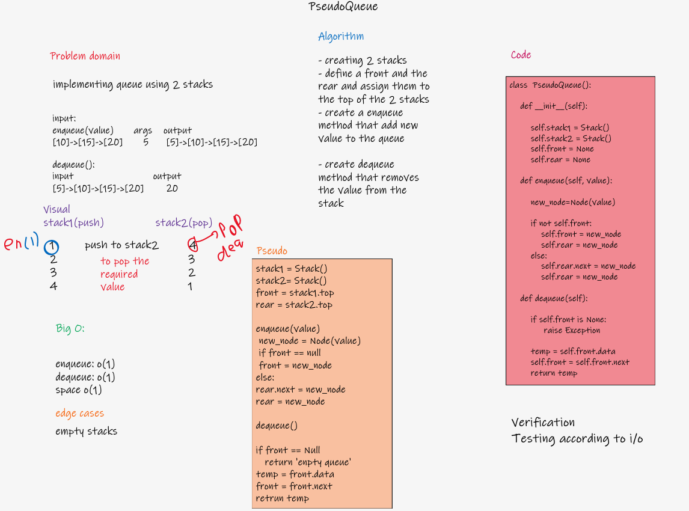

# Challenge Summary

- Create a new class called pseudo queue.

         Do not use an existing Queue.
        Instead, this PseudoQueue class will implement our standard queue interface (the two methods listed below),
        Internally, utilize 2 Stack instances to create and manage the queue

- Methods:

        enqueue
            Arguments: value
            Inserts value into the PseudoQueue, using a first-in, first-out approach.
        dequeue
            Arguments: none
            Extracts a value from the PseudoQueue, using a first-in, first-out approach.h

## Whiteboard Process

## Approach & Efficiency

Time and space complexity

enqueue O(1)

dequeue O(1)

## Solution

[Code implementation](/code401/stack-and-queue/stack_and_queue/pseudo_queue.py)

[Test implementation](/code401/stack-and-queue/tests/test_pseudo_queue.py)
